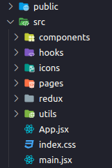

# Crypto View

## Sobre o Projeto

O projeto Crypto View é uma aplicação web responsiva que permite aos usuários visualizar informações sobre criptomoedas, incluindo a listagem das top 10 criptomoedas por capitalização de mercado, detalhes específicos de cada criptomoeda, e a integração com a wallet Metamask para exibir o saldo de Ethereum do usuário. A aplicação também inclui a listagem das criptomoedas em alta. A aplicação foi desenvolvida utilizando React para a interface, Redux para gerenciamento de estado global, react-router-dom para navegação, e chamadas de API RESTful para buscar dados das criptomoedas. Além disso, foi implementado um servidor de proxy para lidar com a política de CORS da API da CoinGecko.

## Tecnologias Utilizadas

- **React**: Utilizado para o desenvolvimento da interface do usuário. [React Documentation](https://reactjs.org/)
- **Redux Toolkit**: Para gerenciamento de estado global da aplicação. [Redux Toolkit Documentation](https://redux-toolkit.js.org/)
- **Axios**: Para realizar chamadas de API RESTful. [Axios Documentation](https://axios-http.com/)
- **Chart.js e React-Chartjs-2**: Para a criação de gráficos de preço das criptomoedas. [Chart.js Documentation](https://www.chartjs.org/), [React-Chartjs-2 Documentation](https://reactchartjs.github.io/react-chartjs-2/)
- **Moment**: Para manipulação e formatação de datas e horas. [Moment Documentation](https://momentjs.com/)
- **React-Router-Dom**: Para navegação entre as páginas da aplicação. [React-Router-Dom Documentation](https://reactrouter.com/web/guides/quick-start)
- **Web3**: Para integração com a wallet Metamask. [Web3 Documentation](https://web3js.readthedocs.io/)
- **Vite**: Como ferramenta de build e desenvolvimento. [Vite Documentation](https://vitejs.dev/)
- **TailwindCSS**: Para estilização dos componentes. [TailwindCSS Documentation](https://tailwindcss.com/docs)
- **Hero Icons**: Para ícones na interface do usuário. [Hero Icons Documentation](https://heroicons.com/)
- **CoinGecko API**: Para buscar informações sobre criptomoedas. [CoinGecko API Documentation](https://www.coingecko.com/api/documentation)

## Como Rodar o Projeto Localmente

1. Clone o repositório do projeto: `git clone https://github.com/matheusprado1/crypto-view.git`
2. Instale as dependências: `npm install`
3. Inicie o servidor de desenvolvimento: `npm run dev`
4. Acesse `http://localhost:5173` no navegador.

## Aplicação ao Vivo

A aplicação está hospedada em [https://crypto-view-4qy7.onrender.com/](https://crypto-view-4qy7.onrender.com/).

## Repositório do Servidor de Proxy

O servidor de proxy utilizado como middleware para lidar com a política de CORS da API da CoinGecko pode ser encontrado em [https://github.com/matheusprado1/crypto-server](https://github.com/matheusprado1/crypto-server).

## Estrutura do Projeto

A estrutura do projeto foi organizada de forma clara e modular, facilitando a manutenção e a compreensão do código.

## Conclusão

O projeto Crypto View demonstra uma aplicação web completa que utiliza várias tecnologias modernas para fornecer informações sobre criptomoedas de forma eficiente e agradável para os usuários. A documentação fornece uma visão geral do projeto, incluindo as tecnologias utilizadas, funcionalidades, como rodar o projeto localmente, e links para recursos adicionais.
